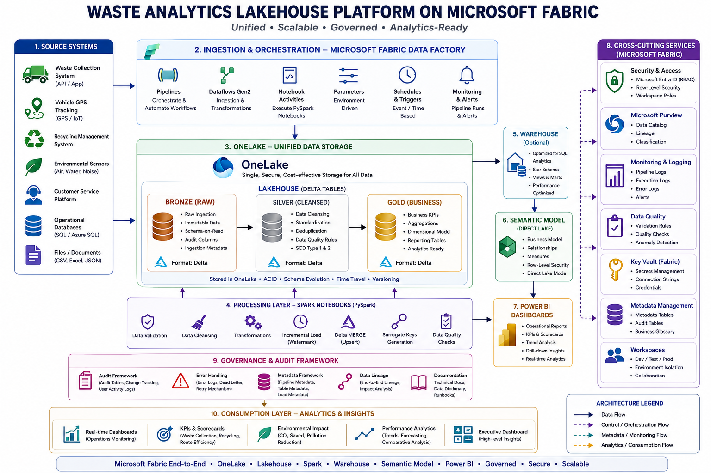
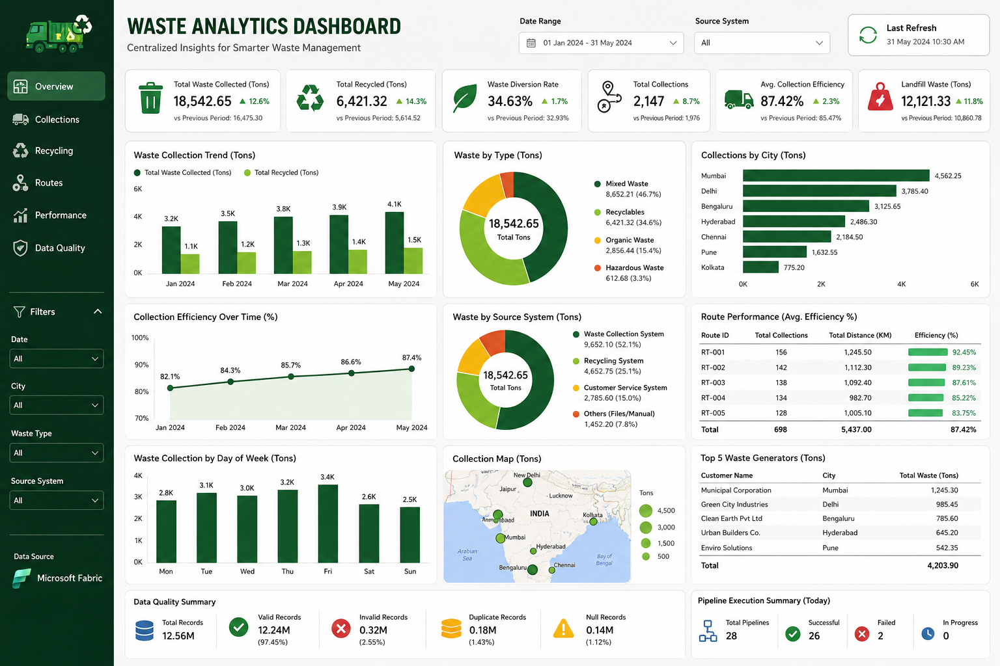

# ♻️ Waste Analytics Lakehouse Platform on Microsoft Fabric

<div align="center">


## Enterprise Waste Analytics Platform Built Using Microsoft Fabric Lakehouse Architecture

**An End-to-End Data Engineering Project implementing Microsoft Fabric, OneLake, Lakehouse, Delta Lake, PySpark, SQL, and Power BI to build a scalable analytics platform for municipal waste management.**

</div>

---

# 📚 Table of Contents

* Overview
* Business Story
* Business Requirements
* Business Problem
* Solution Overview
* Architecture
* Features
* Tech Stack
* Source Systems
* Data Dictionary
* Data Flow
* Medallion Architecture
* Metadata Driven Framework
* ETL Workflow
* PySpark Transformations
* Delta Lake Features
* Audit & Error Logging
* Data Quality Framework
* Performance Optimization
* Key KPIs
* Dashboard
* Business Insights
* Key Outcomes
* Repository Structure
* Learning Outcomes
* Challenges
* Future Enhancements
* Conclusion
* Contact
* Support

---

# 📌 Overview

The Waste Analytics Lakehouse Platform is an enterprise-scale data engineering solution designed to centralize, process, transform, and analyze waste management data using Microsoft Fabric.

The platform integrates data from multiple operational systems into a unified Lakehouse architecture built on Microsoft OneLake. Using Microsoft Fabric Data Factory, PySpark notebooks, Delta Lake, SQL, and Power BI, the platform enables automated data ingestion, transformation, monitoring, and business reporting.

The project follows the Medallion Architecture pattern consisting of Bronze, Silver, and Gold layers to ensure reliable, scalable, and analytics-ready datasets for operational reporting and strategic decision-making.

The solution demonstrates enterprise data engineering practices including metadata-driven ingestion, incremental data loading, audit logging, error handling, data quality validation, Delta Lake optimization, and centralized reporting.

---

# 📖 Business Story

## Scenario

Imagine your client is **GreenCity Municipal Corporation**, one of the fastest-growing smart cities implementing digital transformation for public services.

The municipality is responsible for collecting, transporting, processing, recycling, and disposing of municipal solid waste generated across the city.

The city operates:

* 500 Garbage Trucks
* 150 Municipal Wards
* 25 Waste Transfer Stations
* 3 Recycling Plants
* 2 Landfill Sites

Every day, thousands of operational activities generate valuable business data.

These include:

* Waste Collection Records
* GPS Tracking Data
* Fuel Consumption
* Citizen Complaints
* Vehicle Maintenance Records
* Smart Bin IoT Sensor Data

Each department maintains its own operational system.

For example:

| Department          | System              |
| ------------------- | ------------------- |
| Waste Collection    | SQL Database        |
| Fleet Management    | GPS Tracking System |
| Smart Bins          | IoT Platform        |
| Citizen Services    | Complaint Portal    |
| Vehicle Maintenance | ERP System          |
| Reporting           | Excel Files         |

Although large amounts of operational data are generated every day, the municipality struggles to utilize this data effectively because it exists in multiple disconnected systems.

As a result, city administrators spend hours manually preparing reports instead of making timely operational decisions.

---

# 🎯 Business Requirements

The municipality wanted to build a centralized analytics platform capable of answering business questions such as:

* How much waste was collected today?
* Which ward generated the highest amount of waste?
* Which trucks missed their assigned routes?
* What percentage of collected waste was recycled?
* Which landfill sites are nearing capacity?
* Which collection routes consume the highest amount of fuel?
* Which wards receive the highest number of citizen complaints?
* Which vehicles require preventive maintenance?
* How has waste generation changed over the last twelve months?
* What operational KPIs should management monitor daily?

The primary objective was to create a single source of truth for waste management analytics.

---

# ❗ Business Problem

Before implementing this solution, the municipality faced several operational and technical challenges.

## Data Challenges

* Data was distributed across multiple systems.
* Different departments maintained separate databases.
* Data formats varied across source systems.
* Duplicate records existed across datasets.
* Missing GPS coordinates reduced reporting accuracy.
* Manual Excel-based reporting introduced errors.
* Historical data was difficult to access.
* Reports required several hours to prepare.

## Operational Challenges

* No centralized dashboard.
* Limited visibility into waste collection performance.
* Poor monitoring of recycling activities.
* Difficulty tracking landfill capacity.
* Lack of operational KPIs.
* Slow business decision-making.

Because of these issues, city management could not obtain accurate, real-time operational insights.

---

# 💡 Solution Overview

To solve these challenges, the Waste Analytics Lakehouse Platform was designed using Microsoft Fabric and the Medallion Architecture.

The platform automatically collects data from multiple operational systems, stores raw data inside OneLake, processes and validates the data using PySpark notebooks, transforms it into trusted Delta Lake tables, and finally exposes analytics-ready datasets to Power BI dashboards.

The complete solution provides:

* Centralized data storage using OneLake.
* Automated data ingestion through Fabric Data Factory.
* Data cleansing and validation using PySpark.
* Delta Lake for reliable ACID-compliant storage.
* Incremental data loading for efficient processing.
* Metadata-driven pipeline execution.
* Centralized audit and error logging.
* Power BI dashboards for business users.

### High-Level Solution Flow

```text
CSV Files
REST APIs
IoT Sensors
GPS System
ERP
SQL Database

        │

        ▼

Microsoft Fabric Data Factory

        │

        ▼

OneLake Storage

        │

        ▼

Bronze Layer
(Raw Data)

        │

        ▼

Silver Layer
(Cleansed & Validated)

        │

        ▼

Gold Layer
(Business Ready)

        │

        ▼

Power BI Dashboards

        │

        ▼

Business Decision Making
```

# 🏗️ Architecture

The Waste Analytics Lakehouse Platform is designed using **Microsoft Fabric Lakehouse Architecture** to build a centralized, scalable, and enterprise-ready analytics platform.

The architecture integrates multiple source systems into Microsoft OneLake through Fabric Data Factory pipelines. Data is processed using PySpark notebooks and stored as Delta Lake tables following the Medallion Architecture (Bronze, Silver, and Gold).

The final business-ready datasets are exposed through Power BI dashboards using Direct Lake mode for high-performance analytics.

---

## 📐 Architecture Diagram

> **Replace the image path below with your architecture diagram.**

```markdown

```

---

## 🔄 Architecture Flow

```text
                    Source Systems
      ERP | CRM | GPS | CSV | APIs | SQL Database

                           │
                           ▼
              Microsoft Fabric Data Factory
         Pipelines • Dataflows Gen2 • Scheduler

                           │
                           ▼

                    Microsoft OneLake

                           │
                           ▼

                  Lakehouse (Delta Tables)

        ┌──────────────────────────────────────┐
        │                                      │
        │  Bronze Layer (Raw Data)             │
        │          │                           │
        │          ▼                           │
        │  Silver Layer (Validated Data)       │
        │          │                           │
        │          ▼                           │
        │  Gold Layer (Business Ready Data)    │
        │                                      │
        └──────────────────────────────────────┘

                           ▲
                           │

             PySpark Notebooks (Transformations)

     Delta Merge • Incremental Load • Data Quality

                           │
                           ▼

                Microsoft Fabric Warehouse
                      (Optional Layer)

                           │
                           ▼

               Semantic Model (Direct Lake)

                           │
                           ▼

                  Power BI Dashboards
```

---

## 🏛️ Architecture Components

| Component           | Purpose                                    |
| ------------------- | ------------------------------------------ |
| Source Systems      | Generate operational waste management data |
| Fabric Data Factory | Data ingestion and orchestration           |
| OneLake             | Centralized enterprise storage             |
| Lakehouse           | Stores Delta tables                        |
| Bronze Layer        | Raw source data                            |
| Silver Layer        | Cleansed and validated datasets            |
| Gold Layer          | Analytics-ready business datasets          |
| PySpark Notebooks   | Data transformation and processing         |
| Delta Lake          | Reliable ACID-compliant storage            |
| Semantic Model      | Power BI optimization                      |
| Power BI            | Reporting and visualization                |

---

# ✨ Features

The Waste Analytics Lakehouse Platform includes several enterprise-grade capabilities.

## Data Ingestion

* Metadata-Driven Data Ingestion
* Fabric Data Factory Pipelines
* Dynamic Pipeline Execution
* Parameterized Pipelines
* Automated Scheduling
* Incremental Data Loading

---

## Storage

* Microsoft OneLake
* Delta Lake Storage
* Lakehouse Architecture
* Bronze Layer
* Silver Layer
* Gold Layer

---

## Data Processing

* PySpark Transformations
* SQL Validation
* Schema Validation
* Data Cleansing
* Data Standardization
* Data Deduplication
* Business Rule Validation

---

## Monitoring

* Audit Logging
* Error Logging
* Pipeline Monitoring
* Record Count Validation
* Execution Tracking

---

## Reporting

* Power BI Integration
* Direct Lake Mode
* KPI Dashboards
* Operational Reports
* Historical Trend Analysis

---

## Enterprise Features

* Metadata Driven Framework
* Incremental Processing
* Data Quality Framework
* CI/CD Ready
* Git Integration
* Scalable Lakehouse Design

---

# 🛠️ Tech Stack

The project is implemented using the following technologies.

| Component            | Technology            |
| -------------------- | --------------------- |
| Cloud Platform       | Microsoft Fabric      |
| Data Integration     | Fabric Data Factory   |
| Storage              | Microsoft OneLake     |
| Data Warehouse       | Lakehouse             |
| Processing Engine    | Apache Spark          |
| Programming Language | PySpark               |
| Query Language       | SQL                   |
| Storage Format       | Delta Lake            |
| Reporting            | Power BI              |
| Version Control      | Git                   |
| Monitoring           | Audit & Error Logging |

---

# 📂 Source Systems

The platform integrates data from multiple operational systems responsible for different aspects of municipal waste management.

## Collection Data

Stores daily waste collection records generated by garbage trucks operating across different municipal wards.

Typical information includes:

* Collection ID
* Truck ID
* Ward ID
* Collection Date
* Waste Weight
* Collection Status

---

## GPS Data

Captures the real-time movement of garbage collection vehicles.

Typical information includes:

* Truck ID
* Latitude
* Longitude
* Timestamp
* Speed
* Route ID

---

## IoT Sensor Data

Smart waste bins generate telemetry data indicating their fill levels.

Typical information includes:

* Bin ID
* Fill Percentage
* Temperature
* Battery Status
* Last Updated Time

---

## Citizen Complaint Data

Collected through mobile applications and web portals.

Typical information includes:

* Complaint ID
* Complaint Type
* Ward
* Complaint Date
* Resolution Status

---

## Vehicle Data

Maintains operational information for garbage trucks.

Typical information includes:

* Truck ID
* Driver
* Fuel Consumption
* Maintenance Date
* Vehicle Status

---

## Landfill Data

Stores information regarding waste disposal sites.

Typical information includes:

* Landfill ID
* Capacity
* Current Utilization
* Daily Waste Received
* Remaining Capacity

---

## Summary of Source Systems

| Source             | Description                      |
| ------------------ | -------------------------------- |
| Collection Data    | Daily garbage collection         |
| GPS                | Truck locations                  |
| IoT Sensors        | Bin fill levels                  |
| Citizen Complaints | Mobile application complaints    |
| Vehicle Data       | Fuel consumption and maintenance |
| Landfill Data      | Waste disposal information       |

---

# 📖 Data Dictionary

The project maintains standardized metadata definitions for all source datasets to ensure consistency across the ETL pipeline.

---

## Collection Table

| Column           | Description                  |
| ---------------- | ---------------------------- |
| CollectionID     | Unique collection identifier |
| TruckID          | Garbage truck identifier     |
| WardID           | Municipal ward identifier    |
| CollectionDate   | Date of waste collection     |
| WasteWeight      | Waste collected (kg)         |
| CollectionStatus | Collection completion status |

---

## GPS Table

| Column    | Description              |
| --------- | ------------------------ |
| TruckID   | Garbage truck identifier |
| Latitude  | GPS latitude             |
| Longitude | GPS longitude            |
| Timestamp | GPS capture time         |
| RouteID   | Assigned route           |

---

## Vehicle Table

| Column          | Description           |
| --------------- | --------------------- |
| TruckID         | Vehicle identifier    |
| DriverName      | Assigned driver       |
| FuelUsed        | Fuel consumed         |
| MaintenanceDate | Last maintenance date |
| VehicleStatus   | Active or inactive    |

---

## Citizen Complaint Table

| Column           | Description          |
| ---------------- | -------------------- |
| ComplaintID      | Complaint identifier |
| WardID           | Ward number          |
| ComplaintType    | Complaint category   |
| ComplaintDate    | Date received        |
| ResolutionStatus | Current status       |

---

## Landfill Table

| Column            | Description            |
| ----------------- | ---------------------- |
| LandfillID        | Landfill identifier    |
| Capacity          | Total storage capacity |
| CurrentUsage      | Current utilization    |
| RemainingCapacity | Available capacity     |
| LastUpdated       | Last update timestamp  |

---

## IoT Sensor Table

| Column       | Description          |
| ------------ | -------------------- |
| BinID        | Smart bin identifier |
| FillLevel    | Bin fill percentage  |
| Temperature  | Internal temperature |
| BatteryLevel | Sensor battery level |
| Timestamp    | Reading time         |

---

# 🔄 Data Flow

The Waste Analytics Lakehouse Platform follows a structured ETL (Extract, Transform, Load) process to ingest, validate, transform, and publish data for business reporting.

The platform receives data from multiple operational systems, stores it in Microsoft OneLake, processes it through the Medallion Architecture, and finally delivers analytics-ready datasets to Power BI.

---

## End-to-End Data Flow

```text
Source Systems
(ERP | GPS | SQL | APIs | CSV | IoT)

            │

            ▼

Microsoft Fabric Data Factory

            │

            ▼

Microsoft OneLake

            │

            ▼

Bronze Layer
(Raw Delta Tables)

            │

            ▼

Silver Layer
(Cleansed & Validated Delta Tables)

            │

            ▼

Gold Layer
(Business Ready Delta Tables)

            │

            ▼

Microsoft Fabric Warehouse
(Optional)

            │

            ▼

Semantic Model
(Direct Lake)

            │

            ▼

Power BI Dashboard

            │

            ▼

Business Users
```

---

# 🏗️ Medallion Architecture

The Waste Analytics Lakehouse Platform follows the Medallion Architecture to organize data into three logical layers: Bronze, Silver, and Gold.

This architecture improves data quality, simplifies maintenance, and enables scalable analytics.

---

# 🥉 Bronze Layer (Raw Data)

## Purpose

The Bronze layer stores raw source data exactly as it is received from various operational systems.

No business transformations are performed at this stage.

The objective is to preserve the original data for auditing, historical tracking, and reprocessing if required.

---

## Data Sources

The Bronze layer receives data from:

* SQL Databases
* CSV Files
* REST APIs
* GPS Systems
* IoT Sensors
* ERP Systems

---

## Activities Performed

* Raw Data Ingestion
* Metadata Capture
* Delta Table Creation
* Audit Logging
* Historical Data Storage
* Schema Preservation

---

## Example

```text
Truck01

Ward12

450 KG

NULL GPS

Received Time : 08:15 AM
```

No validation or cleansing is performed in the Bronze layer.

---

# 🥈 Silver Layer (Validated & Cleansed Data)

## Purpose

The Silver layer transforms raw data into clean, standardized, and validated datasets.

This layer is responsible for improving data quality before business users consume the information.

---

## Data Cleansing Activities

* Remove duplicate records
* Handle missing values
* Standardize ward names
* Standardize truck IDs
* Convert data types
* Date formatting
* Validate mandatory columns
* Apply business rules
* Data quality validation

---

## Data Transformations

Typical PySpark operations include:

* Filtering invalid records
* Joining multiple datasets
* Column standardization
* Null handling
* Record deduplication
* Lookup enrichment
* Window functions
* Aggregations

---

## Example

Before Cleaning

```text
Truck01

Ward-12

NULL GPS

450 KG

01-01-2026
```

After Cleaning

```text
Truck01

Ward12

20.2961,85.8245

450 KG

2026-01-01
```

---

# 🥇 Gold Layer (Business Ready Data)

## Purpose

The Gold layer contains business-ready datasets optimized for reporting and analytics.

Business users, analysts, and Power BI dashboards directly consume these tables.

---

## Gold Tables

Examples include:

* Daily Waste Summary
* Waste Collection Analytics
* Recycling Analytics
* Fuel Consumption Analytics
* Route Performance
* Vehicle Utilization
* Landfill Capacity Analysis
* Ward Performance
* Complaint Analytics

---

## Business KPIs

The Gold layer calculates KPIs such as:

* Total Waste Collected
* Daily Collection Efficiency
* Recycling Percentage
* Average Fuel Consumption
* Waste by Ward
* Waste by Vehicle
* Landfill Utilization
* Complaint Resolution Rate

---

## Benefits

* Faster reporting
* Simplified analytics
* Trusted business data
* Improved dashboard performance
* Optimized Power BI queries

---

# ⚙️ Metadata Driven Framework

The Waste Analytics Lakehouse Platform implements a Metadata Driven Framework to reduce manual development and improve scalability.

Instead of creating separate pipelines for every dataset, metadata controls pipeline execution.

---

## Metadata Components

Metadata contains information such as:

* Source System
* Source Table
* Source File
* Target Table
* Load Type
* Primary Key
* Incremental Column
* File Path
* Active Flag

---

## Fabric Components Used

* Lookup Activity
* ForEach Activity
* Parameterized Pipelines
* Dynamic Expressions
* Dynamic File Paths
* Dynamic SQL Queries

---

## Benefits

* Reusable pipelines
* Easy onboarding of new datasets
* Reduced maintenance
* Less manual coding
* Improved scalability
* Faster project delivery

---

# 🔄 ETL Workflow

The project follows a fully automated ETL workflow using Microsoft Fabric Data Factory and PySpark notebooks.

---

## Step 1 – Extract

Data is collected from multiple operational systems.

Examples:

* SQL Database
* CSV Files
* REST APIs
* GPS Devices
* IoT Sensors
* ERP Applications

---

## Step 2 – Load to Bronze

The extracted data is loaded into Delta tables inside the Bronze layer.

Activities include:

* Metadata capture
* Audit logging
* Raw data preservation

---

## Step 3 – Validate

Data validation begins before transformation.

Validation checks include:

* Mandatory column validation
* Schema validation
* File validation
* Record count validation

---

## Step 4 – Transform

PySpark notebooks process the Bronze data and create validated Silver tables.

Typical transformations:

* Remove duplicates
* Handle null values
* Standardize formats
* Apply business rules
* Join reference tables
* Calculate derived columns

---

## Step 5 – Business Aggregation

The Silver datasets are aggregated into Gold tables.

Examples include:

* Daily summaries
* Monthly reports
* KPI calculations
* Trend analysis
* Performance metrics

---

## Step 6 – Publish

The Gold layer is exposed to:

* Microsoft Fabric Warehouse (Optional)
* Semantic Model
* Power BI Dashboards

---

## ETL Process Flow

```text
Receive Data

        │

        ▼

Extract Source Data

        │

        ▼

Load to Bronze Layer

        │

        ▼

Validate Data

        │

        ▼

Transform Using PySpark

        │

        ▼

Create Silver Tables

        │

        ▼

Business Aggregation

        │

        ▼

Create Gold Tables

        │

        ▼

Power BI Dashboard

        │

        ▼

Business Decision Making
```

---

## ETL Benefits

The implemented ETL framework provides:

* Automated pipeline execution
* Reliable data processing
* Standardized transformations
* Improved data quality
* Incremental processing
* Enterprise scalability
* Faster reporting
* Reduced manual effort

---

The combination of Microsoft Fabric Data Factory, OneLake, PySpark, Delta Lake, and the Medallion Architecture enables the Waste Analytics Lakehouse Platform to deliver a robust, scalable, and enterprise-ready analytics solution.

---

# 🔥 PySpark Transformations

PySpark is the core processing engine used in the Waste Analytics Lakehouse Platform. It is responsible for transforming raw operational data into clean, validated, and analytics-ready datasets.

All transformations are executed through Microsoft Fabric Spark Notebooks and stored as Delta Lake tables.

---

## Objectives of Data Transformation

The primary objectives of the transformation layer are to:

* Clean raw source data
* Improve data quality
* Standardize data formats
* Apply business rules
* Join multiple datasets
* Generate business KPIs
* Prepare data for reporting

---

## Transformation Workflow

```text
Raw Data (Bronze)

        │

        ▼

Data Validation

        │

        ▼

Data Cleansing

        │

        ▼

Business Transformations

        │

        ▼

Aggregations

        │

        ▼

Delta Tables (Silver)

        │

        ▼

Gold Business Tables
```

---

## Common PySpark Transformations

The following transformations are implemented throughout the project.

### Data Filtering

Remove invalid or unwanted records before processing.

Examples:

* Invalid Truck IDs
* Negative Waste Weight
* Future Collection Dates
* Empty Ward IDs

---

### Null Value Handling

Missing values are identified and handled appropriately.

Examples:

* Replace missing GPS coordinates
* Default missing fuel values
* Validate mandatory fields
* Remove incomplete records

---

### Duplicate Removal

Duplicate records are removed to ensure data consistency.

Typical duplicate checks include:

* Collection ID
* Truck ID
* Timestamp
* GPS Records

---

### Data Standardization

Standardize source data into a consistent format.

Examples:

* Ward Names
* Date Formats
* Vehicle IDs
* Collection Status
* Unit Conversion

---

### Data Type Conversion

Convert source columns into appropriate data types.

Examples:

* String → Date
* String → Timestamp
* Integer → Decimal
* Text → Boolean

---

### Joining Multiple Datasets

Business reporting requires combining data from multiple operational systems.

Examples:

* Collection + Vehicle
* Vehicle + GPS
* Collection + Ward
* Complaint + Ward
* Landfill + Collection

---

### Window Functions

Window functions are used for advanced analytics.

Examples:

* Ranking
* Running Total
* Moving Average
* Latest Vehicle Status
* Route Ranking

---

### Aggregations

Business-ready metrics are created using aggregation functions.

Examples:

* Daily Waste Collected
* Monthly Waste Collection
* Fuel Consumption
* Recycling Percentage
* Waste by Ward
* Waste by Truck

---

### KPI Calculations

Important KPIs generated include:

* Collection Efficiency
* Vehicle Utilization
* Recycling Rate
* Average Waste per Ward
* Landfill Utilization
* Daily Collection Count

---

### Incremental Processing

Instead of processing the complete dataset every time, only new or modified records are processed.

Benefits:

* Faster execution
* Lower compute cost
* Better scalability
* Reduced processing time

---

# 🗄️ Delta Lake Features

Delta Lake is used as the storage layer for all Lakehouse tables.

It provides reliability, consistency, and high-performance analytics.

---

## ACID Transactions

Delta Lake guarantees Atomicity, Consistency, Isolation, and Durability.

Benefits:

* Reliable data writes
* No partial updates
* Improved data integrity

---

## Schema Enforcement

Incoming data is validated against the existing table schema.

Benefits:

* Prevents incorrect data
* Ensures schema consistency
* Improves data quality

---

## Schema Evolution

Supports automatic schema updates when new columns are introduced.

Benefits:

* Flexible ingestion
* Easier maintenance
* Future-ready architecture

---

## MERGE Operations

MERGE is used for incremental loading and upsert operations.

Supports:

* Insert
* Update
* Delete

Benefits:

* Efficient incremental processing
* Reduced duplicate records
* Simplified ETL logic

---

## Time Travel

Allows querying historical versions of Delta tables.

Benefits:

* Data recovery
* Historical analysis
* Easy debugging

---

## OPTIMIZE

Optimizes file layout for faster query performance.

Benefits:

* Reduced file fragmentation
* Faster reads
* Better Spark performance

---

## Z-Ordering

Improves query performance by organizing data based on frequently filtered columns.

Benefits:

* Faster filtering
* Reduced scan time
* Improved dashboard performance

---

# 📋 Audit & Error Logging Framework

A centralized monitoring framework is implemented to track every pipeline execution.

Audit and Error Logs are maintained using SQL Stored Procedures and Microsoft Fabric pipelines.

---

## Audit Logging

The audit framework records execution details for every pipeline run.

Captured information includes:

* Pipeline Name
* Pipeline Run ID
* Source System
* Target Table
* Start Time
* End Time
* Load Type
* Execution Status
* Records Read
* Records Written
* Records Rejected
* Execution Duration

---

## Error Logging

If a pipeline fails, the error framework captures detailed information.

Captured information includes:

* Error Code
* Error Message
* Failure Stage
* Pipeline Name
* Notebook Name
* Activity Name
* Timestamp
* Source Dataset
* Target Dataset

---

## Benefits

The logging framework provides:

* End-to-end pipeline traceability
* Faster troubleshooting
* Easier production support
* Better monitoring
* Historical execution tracking

---

# ✅ Data Quality Framework

High-quality data is essential for accurate business reporting.

The platform performs multiple validation checks before publishing data to the Gold layer.

---

## Data Validation Checks

### Mandatory Field Validation

Examples:

* Truck ID
* Collection ID
* Ward ID
* Collection Date

---

### Duplicate Validation

Duplicate records are identified using business keys.

Examples:

* Collection ID
* GPS Timestamp
* Complaint ID

---

### Data Type Validation

Checks whether incoming data matches the expected schema.

Examples:

* Date
* Timestamp
* Integer
* Decimal
* Boolean

---

### Range Validation

Ensures numeric values fall within acceptable limits.

Examples:

* Waste Weight
* Fuel Consumption
* Fill Level Percentage

---

### GPS Validation

Checks the validity of GPS coordinates.

Examples:

* Missing Latitude
* Missing Longitude
* Invalid Coordinate Range

---

### Business Rule Validation

Business-specific rules are enforced.

Examples:

* Waste Weight cannot be negative.
* Collection Date cannot be in the future.
* Truck must belong to an active fleet.
* Ward ID must exist in the master table.

---

## Data Quality Benefits

The implemented framework helps:

* Improve reporting accuracy
* Increase business trust
* Reduce manual corrections
* Ensure reliable analytics
* Improve downstream processing

---

# ⚡ Performance Optimization

The Waste Analytics Lakehouse Platform is optimized for enterprise-scale datasets.

Several Spark and Delta Lake optimization techniques are implemented to improve processing speed and reduce execution time.

---

## Partitioning

Large Delta tables are partitioned based on frequently filtered columns.

Examples:

* Collection Date
* Ward ID
* Region

Benefits:

* Faster reads
* Reduced scan time
* Better query performance

---

## Broadcast Joins

Small lookup tables are broadcast during joins.

Examples:

* Ward Master
* Vehicle Master
* Status Lookup

Benefits:

* Reduced shuffle
* Faster joins
* Lower execution time

---

## Caching

Frequently accessed DataFrames are cached in memory.

Benefits:

* Faster iterative processing
* Improved notebook performance
* Reduced recomputation

---

## Adaptive Query Execution (AQE)

Spark dynamically optimizes execution plans during runtime.

Benefits:

* Better join strategies
* Optimized partition sizes
* Improved overall performance

---

## Delta OPTIMIZE

Periodic optimization compacts small files into larger files.

Benefits:

* Faster query execution
* Improved storage efficiency
* Better Power BI performance

---

## Z-Ordering

Frequently queried columns are reorganized using ZORDER.

Examples:

* Ward ID
* Collection Date
* Truck ID

Benefits:

* Faster filtering
* Improved dashboard responsiveness
* Reduced I/O operations

---

## Incremental Processing

Only new and changed data is processed during pipeline execution.

Benefits:

* Lower processing cost
* Faster execution
* Better scalability
* Efficient resource utilization

---

## Performance Benefits

The optimization strategies implemented in this project provide:

* Reduced pipeline execution time
* Improved Spark performance
* Faster Power BI dashboard refresh
* Efficient storage management
* Better scalability for enterprise workloads
* Optimized Delta Lake operations

---

The combination of PySpark transformations, Delta Lake capabilities, robust logging, comprehensive data quality validation, and performance optimization ensures that the Waste Analytics Lakehouse Platform delivers reliable, scalable, and high-performance analytics for enterprise waste management.

---

# 📊 Key KPIs

The Waste Analytics Lakehouse Platform provides business users with a comprehensive set of Key Performance Indicators (KPIs) to monitor daily operations, measure service efficiency, and support strategic decision-making.

These KPIs are calculated in the Gold layer using business-ready Delta tables and are visualized through Power BI dashboards.

---

## Operational KPIs

* Total Waste Collected
* Daily Waste Collection
* Monthly Waste Collection
* Yearly Waste Collection
* Total Collection Trips
* Average Waste per Trip
* Waste Collected per Ward
* Waste Collected per Vehicle

---

## Fleet KPIs

* Total Active Garbage Trucks
* Vehicle Utilization
* Fuel Consumption
* Average Fuel Consumption per Route
* Distance Travelled
* Vehicle Maintenance Status
* Missed Collection Routes

---

## Recycling KPIs

* Total Recyclable Waste
* Recycling Percentage
* Waste Diverted from Landfill
* Recycling Plant Performance
* Material Recovery Rate

---

## Landfill KPIs

* Total Landfill Capacity
* Current Utilization
* Remaining Capacity
* Daily Waste Received
* Landfill Usage Trend

---

## Citizen Service KPIs

* Total Complaints
* Complaint Resolution Rate
* Average Resolution Time
* Complaints by Ward
* Complaints by Category

---

# 📈 Dashboard

The business users interact with the Gold layer through Microsoft Power BI dashboards built on Microsoft Fabric Direct Lake mode.

These dashboards provide real-time insights into municipal waste management operations.

---

## Dashboard Reports

The reporting solution includes the following dashboards:

### Waste Collection Dashboard

Displays:

* Daily Waste Collection
* Monthly Collection Trend
* Waste by Ward
* Waste by Vehicle
* Waste by Collection Route

---

### Fleet Performance Dashboard

Displays:

* Vehicle Utilization
* Fuel Consumption
* Route Performance
* Missed Collections
* Vehicle Maintenance

---

### Recycling Dashboard

Displays:

* Recycling Percentage
* Material Recovery
* Recycling Plant Performance
* Waste Diversion Trend

---

### Landfill Dashboard

Displays:

* Landfill Utilization
* Remaining Capacity
* Daily Disposal
* Capacity Forecast

---

### Citizen Complaint Dashboard

Displays:

* Complaints by Ward
* Complaint Categories
* Resolution Status
* Resolution Time

---

## Dashboard Screenshot

> Replace the image below with your Power BI dashboard.

```markdown

```

---

# 💼 Business Insights

The Gold layer enables business users and city administrators to generate meaningful operational insights.

Examples include:

* Ward 14 generated **18% more waste** than the city average.
* Route 27 had the **highest fuel consumption** among all collection routes.
* Recycling efficiency increased from **42% to 61%**.
* Two landfill sites are expected to reach capacity within the next six months.
* Ward 32 recorded the highest number of citizen complaints.
* Vehicle TRK-112 required maintenance more frequently than other vehicles.
* Daily waste collection increased during festive seasons.
* Fuel consumption was significantly higher on longer collection routes.

These insights help management improve operational planning, optimize resource allocation, and enhance service quality.

---

# 🎯 Key Outcomes

The Waste Analytics Lakehouse Platform successfully delivers a scalable, enterprise-ready analytics solution for municipal waste management.

| Metric         | Result                 |
| -------------- | ---------------------- |
| Architecture   | Medallion Architecture |
| Cloud Platform | Microsoft Fabric       |
| Storage        | Microsoft OneLake      |
| Processing     | PySpark                |
| Storage Format | Delta Lake             |
| Data Loading   | Incremental Processing |
| Data Quality   | Automated Validation   |
| Monitoring     | Audit & Error Logging  |
| Reporting      | Power BI               |
| Scalability    | Enterprise Ready       |

---

## Business Benefits

The implemented solution provides:

* Centralized enterprise data platform
* Automated data ingestion
* Reliable analytics-ready datasets
* Improved reporting accuracy
* Better operational visibility
* Faster business decision-making
* Reduced manual reporting effort
* Enterprise scalability

---

# 📂 Repository Structure

```text
Waste-Analytics-Lakehouse-Platform
│
├── README.md
│
├── architecture
│   └── Waste_Analytics_Lakehouse_Architecture.png
│
├── adf
│   ├── adf.txt
│   └── Azure_Data_Factory.docx
│
├── notebooks
│   ├── Common_Method.ipynb
│   ├── DDL.ipynb
│   ├── Salesforce_Tables_DDL_Scripts.ipynb
│   └── Warehouse_Config_Tables_DDL.ipynb
│
├── sql
│   ├── Create_Schema_Source.sql
│   └── SP_AUDIT_ERROR_LOGS.sql
│
├── metadata
│   └── field_mapping.xlsx
│
├── pyspark
│   └── spark_notes.txt
│
└── dashboard
    └── Waste_Analytics_Dashboard.png
```

---

# 🎓 Learning Outcomes

This project demonstrates practical implementation of enterprise data engineering concepts using Microsoft Fabric.

Key learning areas include:

* Microsoft Fabric
* Fabric Data Factory
* Microsoft OneLake
* Lakehouse Architecture
* Medallion Architecture
* Apache Spark
* PySpark
* Delta Lake
* Incremental Processing
* Metadata Driven Framework
* Data Quality Validation
* Audit & Error Logging
* SQL Stored Procedures
* Power BI Integration
* Enterprise ETL Design
* Performance Optimization
* Git Version Control

---

# 🚧 Challenges

During the development of the Waste Analytics Lakehouse Platform, several engineering challenges were identified and addressed.

## Data Challenges

* Large volume of operational data
* Duplicate records across multiple systems
* Missing GPS coordinates
* Schema changes in incoming files
* Inconsistent data formats
* Late-arriving source files

---

## Pipeline Challenges

* Dynamic ingestion of multiple datasets
* Parameterized pipeline execution
* Metadata management
* Incremental loading
* Error handling
* Pipeline monitoring

---

## Performance Challenges

* Processing large datasets
* Optimizing Spark transformations
* Managing small Delta files
* Efficient join strategies
* Faster dashboard refresh

---

## Solution Approach

These challenges were addressed using:

* Metadata-driven framework
* Incremental processing
* Delta MERGE operations
* Data quality validation
* Spark optimization techniques
* Audit and error logging
* Delta OPTIMIZE and ZORDER

---

# 🚀 Future Enhancements

The current platform provides a strong foundation and can be further enhanced with additional enterprise capabilities.

Future improvements include:

* Real-time streaming using Microsoft Fabric Eventstream
* IoT-based real-time smart bin monitoring
* Predictive waste generation using Machine Learning
* AI-based collection route optimization
* Automated anomaly detection
* Geospatial analytics using GIS data
* Advanced fleet optimization
* Microsoft Fabric Real-Time Analytics
* Integration with external municipal systems
* Advanced KPI forecasting using AI

---

# 📝 Conclusion

The Waste Analytics Lakehouse Platform demonstrates the implementation of an enterprise-grade Lakehouse solution using Microsoft Fabric.

The project successfully integrates multiple operational data sources into a centralized analytics platform using OneLake, Fabric Data Factory, PySpark, Delta Lake, and Power BI.

By implementing the Medallion Architecture, metadata-driven ingestion, incremental processing, data quality validation, audit logging, and performance optimization techniques, the platform delivers reliable, scalable, and analytics-ready datasets for business reporting.

The solution improves operational visibility, enhances reporting accuracy, reduces manual effort, and enables data-driven decision-making for municipal waste management.

This project reflects modern data engineering practices and showcases the capabilities of Microsoft Fabric for building scalable enterprise analytics platforms.

---

# 📧 Contact

**Subhrajit Behera**

**Azure Data Engineer | Microsoft Fabric Engineer | Databricks Engineer**

📧 Email: *Add your email here*

🔗 GitHub: https://github.com/SubhrjiT

🔗 LinkedIn: https://linkedin.com/in/subhrajit-behera

---

# ⭐ Support

If you found this project useful, please consider giving it a ⭐ on GitHub.

Your support helps others discover the project and encourages further improvements.

---

<div align="center">

## ✅ Project Status

**Production Ready**

Built with ❤️ using **Microsoft Fabric**, **OneLake**, **PySpark**, **Delta Lake**, and **Power BI**

</div>


