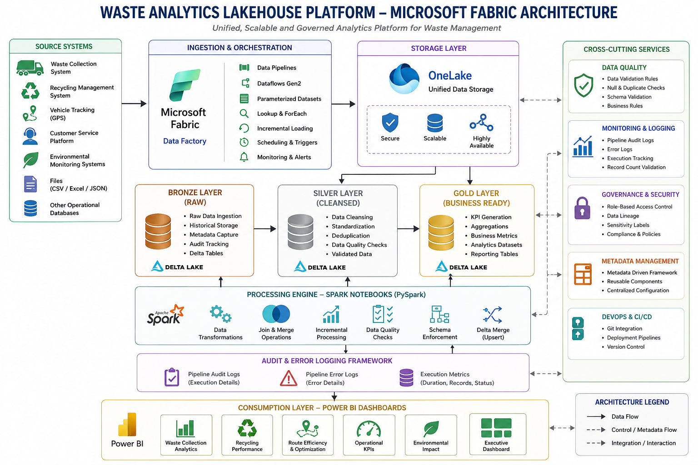

# Waste Analytics Lakehouse Platform on Microsoft Fabric

<div align="center">


**Enterprise Waste Analytics Platform Built Using Microsoft Fabric Lakehouse Architecture**

</div>

---

# 📌 Overview

The Waste Analytics Lakehouse Platform is an enterprise data engineering solution built on Microsoft Fabric to centralize, process, transform, and analyze waste management data from multiple source systems.

The platform leverages Microsoft Fabric Data Factory, OneLake, Lakehouse, PySpark Notebooks, Delta Tables, SQL-based audit logging, and Power BI to deliver trusted analytics-ready datasets for business reporting.

The solution follows the Medallion Architecture pattern using Bronze, Silver, and Gold layers.

---

# 🎯 Business Problem

Organizations generate waste management data from various operational systems. This data often exists in multiple formats and locations, making reporting and analytics difficult.

Challenges:

* Data spread across multiple systems
* Lack of centralized reporting
* Manual data processing
* Data quality issues
* Limited visibility into operational KPIs

The Waste Analytics Lakehouse Platform solves these challenges by creating a centralized analytics platform on Microsoft Fabric.

---

# 🏗️ Architecture

## Architecture Diagram



---

## Architecture Flow

```text
                    Source Systems
      ERP | CRM | GPS | CSV | APIs | SQL DB

                           │
                           ▼
              Microsoft Fabric Data Factory
         Pipelines • Dataflows Gen2 • Scheduler
                           │
                           ▼
                     OneLake Storage
        ┌──────────────────────────────────┐
        │      Lakehouse (Delta Tables)    │
        │                                  │
        │ Bronze (Raw)                     │
        │        │                         │
        │        ▼                         │
        │ Silver (Cleaned)                 │
        │        │                         │
        │        ▼                         │
        │ Gold (Business)                  │
        └──────────────────────────────────┘
                 ▲           ▲
                 │           │
         Spark Notebooks (PySpark)
     Delta Merge | DQ | SCD | Incremental Load

                 │
                 ▼
          Fabric Warehouse (Optional)
                 │
                 ▼
      Semantic Model (Direct Lake Mode)
                 │
                 ▼
            Power BI Dashboards

---------------------------------------------------
Cross-cutting Services
---------------------------------------------------
✓ Monitoring
✓ Logging
✓ Data Quality
✓ RBAC
✓ Purview
✓ CI/CD
✓ Git Integration
✓ Deployment Pipelines
✓ Parameterization
✓ Metadata
---

---

# ✨ Features

* Metadata-Driven Data Ingestion
* Fabric Data Factory Pipelines
* OneLake Unified Storage
* Bronze, Silver and Gold Architecture
* PySpark Data Transformations
* Delta Lake Storage
* Incremental Data Loading
* Schema Validation
* Data Quality Checks
* Audit Logging Framework
* Error Logging Framework
* Automated Reporting
* Power BI Dashboard Integration

---

# 🛠️ Tech Stack

| Component         | Technology            |
| ----------------- | --------------------- |
| Data Platform     | Microsoft Fabric      |
| Data Integration  | Fabric Data Factory   |
| Storage           | OneLake               |
| Data Warehouse    | Lakehouse             |
| Processing Engine | Apache Spark          |
| Language          | PySpark               |
| Query Language    | SQL                   |
| Storage Format    | Delta Lake            |
| Reporting         | Power BI              |
| Monitoring        | Audit & Error Logging |
| Version Control   | Git                   |

---

# 🔄 Data Flow

## Bronze Layer

Purpose:
Store raw source data exactly as received.

Activities:

* Data Ingestion
* Historical Data Storage
* Metadata Capture
* Audit Tracking
* Delta Table Storage

---

## Silver Layer

Purpose:
Create validated and cleansed datasets.

Activities:

* Null Handling
* Data Cleansing
* Standardization
* Deduplication
* Schema Validation
* Data Quality Checks

---

## Gold Layer

Purpose:
Create analytics-ready business datasets.

Activities:

* Business Aggregations
* KPI Calculations
* Reporting Tables
* Dashboard Consumption

---

# 🔍 Metadata Driven Framework

The platform uses a metadata-driven ingestion framework to process multiple datasets dynamically.

Implemented Using:

* Lookup Activity
* Parameterized Datasets
* ForEach Activity
* Dynamic Source Mapping
* Dynamic Target Mapping

Benefits:

* Reusable Pipelines
* Reduced Development Effort
* Easy Onboarding of New Data Sources
* Improved Maintainability

---

# 📋 Audit & Error Logging Framework

A centralized monitoring framework was implemented using SQL Stored Procedures.

### Audit Logging

Captures:

* Pipeline Name
* Run ID
* Start Time
* End Time
* Source Details
* Target Details
* Record Counts

### Error Logging

Captures:

* Error Code
* Error Description
* Execution Status
* Failure Type
* Runtime Information
* Pipeline Details

Benefits:

* Faster Troubleshooting
* Better Monitoring
* Complete Pipeline Traceability

---

# 📊 Key KPIs

The platform provides reporting on:

* Total Waste Processed
* Waste Collection Trends
* Operational Performance
* Processing Efficiency
* Business Metrics
* Historical Trend Analysis

---

# 📈 Key Outcomes

| Metric       | Result                 |
| ------------ | ---------------------- |
| Architecture | Medallion Architecture |
| Storage      | OneLake                |
| Processing   | PySpark                |
| Data Format  | Delta Lake             |
| Data Loading | Incremental            |
| Monitoring   | Automated              |
| Reporting    | Power BI               |
| Scalability  | Enterprise Ready       |

---

# 📊 Dashboard


---

# 📂 Repository Structure

```text
Waste-Analytics-Lakehouse-Platform
│
├── README.md
│
├── architecture
│   └── Waste_Analytics_Lakehouse_Architecture.png
│
├── adf
│   ├── adf.txt
│   └── Azure_Data_Factory.docx
│
├── notebooks
│   ├── Common_Method.ipynb
│   ├── DDL.ipynb
│   ├── Salesforce_Tables_DDL_Scripts.ipynb
│   └── Warehouse_Config_Tables_DDL.ipynb
│
├── sql
│   ├── Create_Schema_Source.sql
│   └── SP_AUDIT_ERROR_LOGS.sql
│
├── metadata
│   └── field_mapping.xlsx
│
├── pyspark
│   └── spark_notes.txt
│
└── dashboard
    └── Waste_Analytics_Dashboard.png
```

---

# 🎓 Learning Outcomes

* Microsoft Fabric
* Fabric Data Factory
* OneLake
* PySpark
* Delta Lake
* Medallion Architecture
* Incremental Processing
* Metadata Driven Framework
* Data Quality Validation
* Audit & Error Logging
* Power BI Integration

---

# 📧 Contact

**Subhrajit Behera**

Azure Data Engineer | Microsoft Fabric Engineer

GitHub: https://github.com/SubhrjiT

LinkedIn: https://linkedin.com/in/subhrajit-behera

---

# ⭐ Support

If you found this project useful, please give it a ⭐ on GitHub.

---

**Status:** ✅ Production Ready

Built with ❤️ using Microsoft Fabric
# Waste-Analytics-Lakehouse-Platform-
